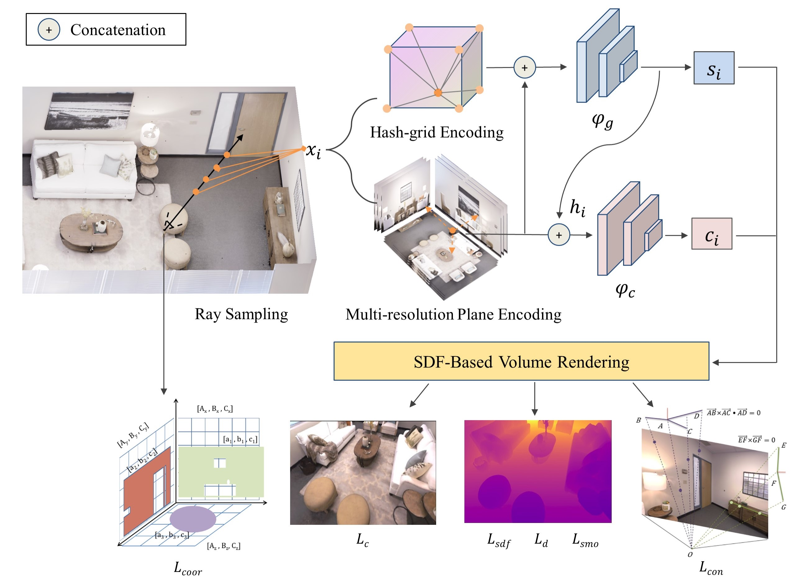

# iS-MAP：iS-MAP: Neural Implicit Mapping and Positioning for Structural Environments

Overview of the system: We sample the 3D points along the ray from each pixel and then encode the sample points by hybrid hash and multi-scale feature plane, and decode them to the TSDF value $s_i$ and the TSDF feature $h_i$ by the geometric decoder  $\varphi_{g}$. Considering the consistency of geometry and appearance, $h_i$ is then concatenated with the feature plane encoding $\rho(x_{i})$ to predict the raw color $c_i$ by appearance decoder  $\varphi_{c}$.  After TSDF volume rendering, the scene representation is optimized by minimizing  sdf loss $L_{sdf}$, smooth loss $L_{smo}$, depth loss $L_d$ , color loss $L_c$ and structural consistency loss $L_{con}$ in the mapping thread. Additionally, we also added Manhattan matching loss $L_{coor}$ to the tracking thread to further optimize the camera pose.

**The code will be coming soon**